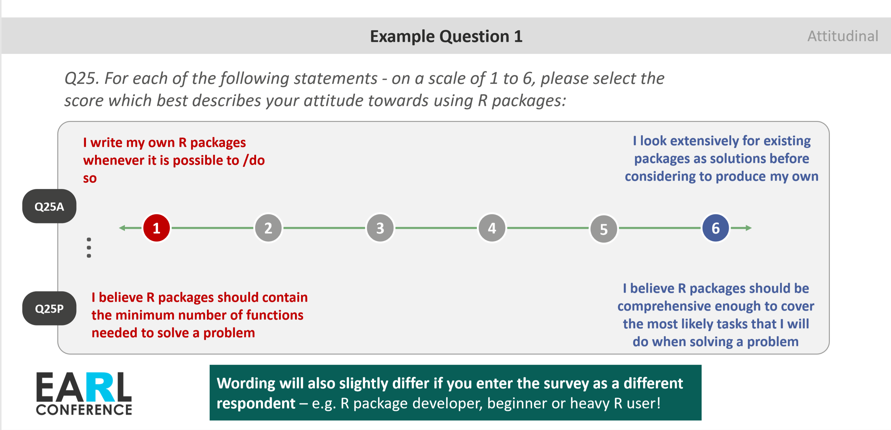
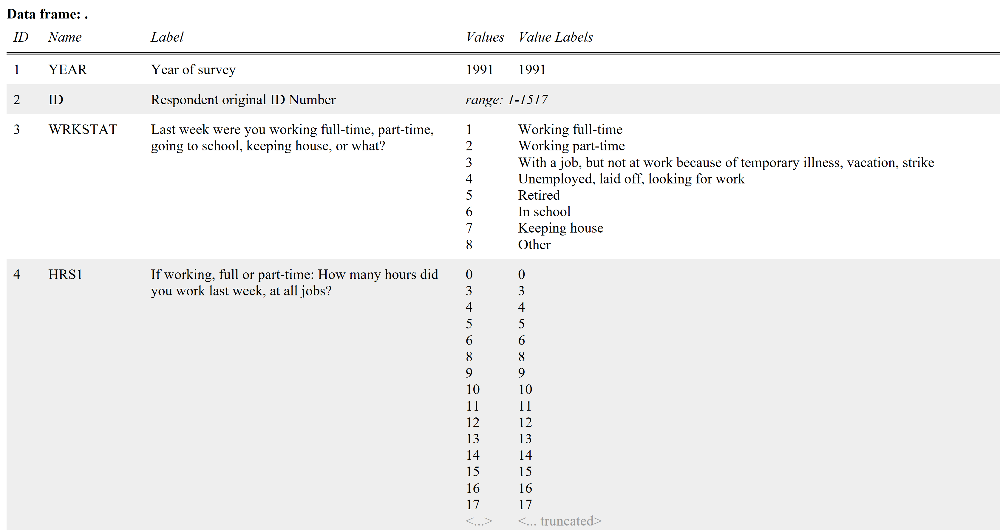

```{r message=FALSE, warning=FALSE, include=FALSE, paged.print=FALSE}
library(prettyjekyll)
library(tidyverse)
# prettyjekyll::FormatPost("_knitr/SPSS_Labels_in_R_18-05-19.Rmd")
# servr::jekyll("../blog")
```

## tl;dr `r emo::ji("smile")`
This post provides an overview of functions for dealing with survey data labels that I wish I'd known when I was starting out analysing SPSS data in R. Some of these functions are from my own package (GitHub only) [surveytoolbox](https://nicedoc.io/martinctc/surveytoolbox) which is a collection of R functions I frequently use when analysing survey data.

---

## Background

As a significant proportion of my analysis involves survey data, I'm always on the look out for new and better ways to improve my survey analysis workflow in R. Funnily enough, when I was first starting out to use R I didn't think R was at all intuitive or easy to work with survey data. Rather painful if I'm completely honest!

One of the big reasons for this "pain" was due to survey labels. 

Survey data generally cannot be analysed independently of the **variable** (e.g. *Q1. What is your gender?*) and **value labels** (e.g. 1 = **Male**, 2 = **Female**, 3 = **Other**, ...), which is true in the case of **categorical variables**.  

Even for ordinal Likert scale variables such as "*On a scale of 1 to 10, how much do you agree with...*", the meaning of the value is highly dependent on the nuanced wording of the agree-disagree statement. For instance:

1. Respondents with a different classification within the survey (e.g. "working professional" vs "retirees") may also have answered a statement that is worded slightly differently but their responses are reflected using a single variable in the data: for instance, working professionals may be asked about their satisfaction with their current employer in the survey, and retirees asked about their previous employer. 

2. In my talk at the [EARL conference](https://martinctc.github.io/downloads/EARL%202018%20-%20Swiss%20Army%20Knife%20for%20Market%20Research%20-%20Martin%20Chan%20-%2010%20September%202018.pdf#) last year, I also discussed a specific type of trade-off agreement question where any interpretation of the data is particularly sensitive to the value labels:

```{r earl-slide, echo=FALSE, message=FALSE, warning=FALSE, out.width='80%'}

```

My experience was that the base **data frame** in R does not easily lend itself to work easily with these labels. A lot of merging, sorting, recoding etc. therefore is then necessary in order to turn the analysis into neat output contingency tables that you typically get via other specialised survey analysis software, like SPSS or [Q](https://www.qresearchsoftware.com/). Here's an example (with completely made up numbers) of what I would typically need to produce as an output:

```{r echo=FALSE, message=FALSE, warning=FALSE}
tibble(`Q10 Top 2 Box Agree` = c("Coding R is one of my hobbies",
                                 "I don't like to spend time in front of the computer on weekends",
                                 "I would be inclined to quit my job if I couldn't use R for data analysis"),
       `R Users Segment` = c("88.1%","40.5%","70.1%"),
       `Python Users Segment` = c("60.0%","39.1%","40.5%")) %>%
  knitr::kable()
```

Of course, another big reason was my own ignorance of all the different methods and packages available out there at the time, which would have otherwise made a lot of this easier! `r emo::ji("stuck_out_tongue")`

This post provides a tour of the various functions (from different packages) that I wish I had known at the time. Despite the title, it's not just about **SPSS**: there are plenty of other formats (e.g. SAS files) out there which carry variable and value labels, but I think this title is justified because:

1. Most people starting out on survey data analysis will tend to first come across SPSS files (.sav) 
2. It's still one of the most popular data formats for survey data
3. It's a SPSS file that I will use as a demo in this post (perhaps not a compelling reason, but still a reason)

---

## Let's start! `r emo::ji("rocket")`

Let us first load in all the packages that we'll use in this post. For clarity, I will still make the package-source of the functions explicit (e.g. `labelled::val_label()`) so it's easy to see where each function comes from. One of these packages  **surveytoolbox** is my own and available on Github only, and if you're interested you can install this by running `devtools::install_github("martinctc/surveytoolbox")`.

```{r message=FALSE, warning=FALSE, include=TRUE}
library(tidyverse)
library(haven)
library(sjlabelled)
library(labelled) 
library(surveytoolbox) # install with devtools::install_github("martinctc/surveytoolbox")
```

Since all I really needed is just an open-source, simple, and accessible SPSS / .sav dataset with variable and value labels that I could use for examples, I simply went online and found the first dataset that matched these criteria. Not the most exciting - it's the **1991 General Social Survey**, which is a nationally representative sample of adults in the United States. You can download the SAV file from the ARDA site [here](http://www.thearda.com/Archive/Files/Downloads/GSS1991_DL2.asp).

`haven::read_sav()` is my favourite way of loading in SPSS files. In my experience, it rarely has any problems and is generally fast enough; it is also part of the [tidyverse](https://haven.tidyverse.org/). There are other alternatives such as `sjlabelled::read_spss()` and `foreign::read.spss()`, but **haven** is my recommendation - you can pick a favourite and have these available in your backpocket.[^2] Note that `foreign::read.spss()` returns a list rather than a data frame or a tibble, which for me is less ideal for analysis.

```{r echo=TRUE, results = 'hide', message=FALSE, warning=FALSE}
file_path <- "../datasets/General Social Survey_1991.SAV"

source_data_hv <- haven::read_sav(file_path)
source_data_sj <- sjlabelled::read_spss(file_path)
source_data_fo <- foreign::read.spss(file_path)
```

Running `glimpse()` on the first twenty rows show that many variables are of the **labelled double** class (where it shows `<dbl+lbl>`) - meaning that these variables would have labels associated with the numeric values they hold. The numbers alone us tell us nothing about what they represent, as these are likely to be categorical variables "in reality".

```{r echo=TRUE, message=FALSE, warning=FALSE}
source_data_hv %>% # File read in using `haven::read_sav()`
  .[,1:20] %>% # First 20 columns
  glimpse() 
```

Note that `haven::read_sav()` reads these labelled variables in as a class called `haven_labelled`, whilst `sjlabelled::read_spss()` would read these in as numeric variables cotaining label attributes.

Using **haven**:
```{r}
source_data_hv$MARITAL %>% class()

```
Using **sjlabelled**:
```{r}
source_data_sj$MARITAL %>% class()
```


Running `attr()` whilst specifying "labels" shows that both methods of reading the SPSS file return variables that contain value label attributes. Note that specifying "label**s**" (with an *s*) typically returns value labels, whereas "label" (no *s*) would return the variable labels. 

Viewing **value** labels for data imported using **haven**:
```{r}
source_data_hv$MARITAL %>% attr('labels')

```

Viewing **value** labels for data imported using **sjlabelled**:
```{r}
source_data_sj$MARITAL %>% attr('labels')
```

Viewing **variable** labels for data imported using **haven**:
```{r}
source_data_hv$MARITAL %>% attr('label')

```

Viewing **variable** labels for data imported using **sjlabelled**:
```{r}
source_data_sj$MARITAL %>% attr('label')
```

As you can see, there are no differences in the labels returned whether the data is imported using **haven** or **sjlabelled**.

---

## Exploring the dataset

For the subsequent examples, I shall use the tibble read in with **haven** for simplicity.

Before you perform any analysis it's necessary to first explore what variables and variable codes (value labels) are available in the data, which is needed if you do not have the original questionnaire. Here are several of my favourite functions:

1. `sjPlot::view_df()`
2. `surveytoolbox::varl_tb()`
3. `surveytoolbox::extract_vallab()`

```{r eval=FALSE}
source_data_hv %>% sjPlot::view_df()
```

The `view_df()` function from the **sjPlot** package returns a pretty HTML document that, by default, contains a table that details the following for all the variables in the data:

- Variable name
- Variable label
- Value range / Values
- Value labels

Here's a screenshot of the generated document:
```{r viewdf, echo=FALSE, message=FALSE, warning=FALSE, out.width='80%'}

```

Check out this link to see a full example of what's generated with the function:

[Click here](https://martinctc.github.io/blog/_knitr/sjPlot_view_df.html)

The documentation for `view_df()` also states that you can show percentages and frequencies for each variable, which is a pretty nifty feature for exploring a dataset.

But what if you wished to extract individual labels for further formatting / analysis?

The `varl_tb()` from the [surveytoolbox](https://www.github.com/martinctc/surveytoolbox) allows you to export variable names and their labels, returning a tidy data frame. This provides a convenient way of extracting labels if there is a desire to run string manipulation operations on the labels to be used for something else. This is what the output looks like if you run `varl_tb()` on the first twenty columns of our dataset:  

```{r}
## NOT RUN - USE THIS TO INSTALL THE surveytoolbox PACKAGE
# devtools::install_github("martinctc/surveytoolbox") 

source_data_hv %>%
  .[,1:20] %>%
  varl_tb()
```

The additional benefit of this function is that this is all magrittr-pipe optimised, so this fits perfectly with a dplyr-oriented workflow. 

If you're interested in extracting individual value labels, another method is available within **surveytoolbox** through `extract_vallab()`. This is easy: simply enter the variable name as the second argument (as a string):

```{r}
source_data_hv %>%
  extract_vallab("WRKSTAT")
```

You can then use the output from `extract_vallab()` for joining / editing labels with analysis outputs if needed.

---

## To be continued..?

Big subject

Only touched the surface

Many ways to do a similar thing, but this is what I found to work well with my workflow / code

Welcome any comments / feedback

Hope to write more about other methods in Part 2

---

[^1]: In this post, the focus of the dicussion would be more on labelled vectors than *factors*; in line with the principle listed in **haven**'s [documentation on the labelled function](https://haven.tidyverse.org/reference/labelled.html), the best practice is to analyse the data using a standard R class, but knowing how to deal with labels is useful at the importing / data checking stage.

[^2]: See [this](https://www.r-bloggers.com/working-with-spss-data-in-r/) blog post for a more in-depth discussion on the differences 
