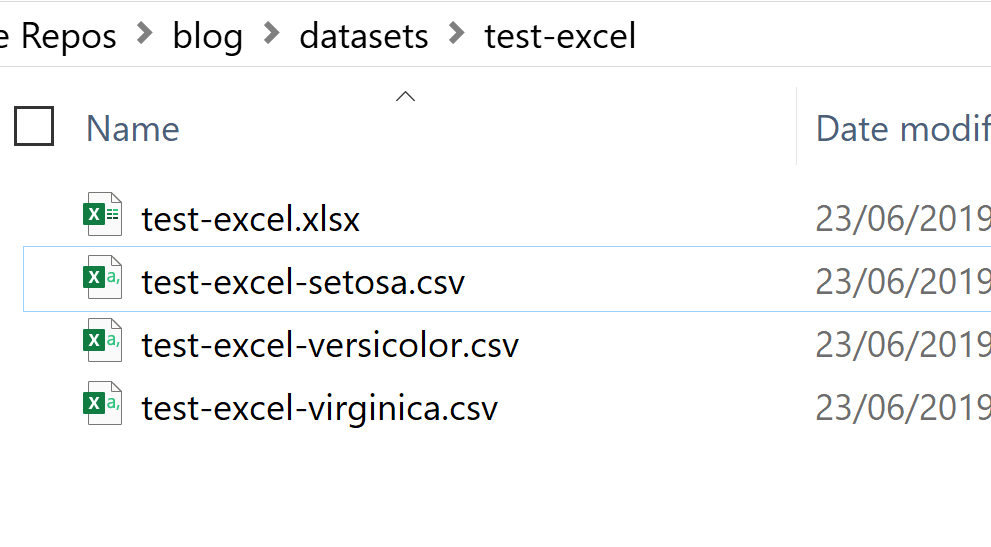
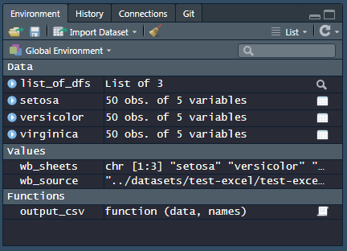

```{r eval=FALSE, include=FALSE}
# prettyjekyll::FormatPost("_knitr/First_Post_13-04-19.Rmd")
```


## Background

This post will show you how to write and read a list of data frames / tibbles through using [**purrr**](https://purrr.tidyverse.org/), the functional programming package `r emo::ji("package")` from tidyverse. I will also use the packages **readxl** and **writexl** for reading and writing in Excel files.

```{r purrr, echo=FALSE, out.width = '20%', out.extra='style="float:right; padding:10px"'}
knitr::include_graphics("../images/pp550x5501.jpg")
```

```{r readxl, echo=FALSE, out.width = '20%', out.extra='style="float:right; padding:10px"'}
knitr::include_graphics("../images/readxl.png")
```

Whilst the internet is certainly in no shortage of R tutorials on how to read and write Excel files (see [this Stack Overflow thread](https://stackoverflow.com/questions/32888757/how-can-i-read-multiple-excel-files-into-r) for example), I think a **purrr** approach still isn't as well-known or well-documented. I find this approach to be very clean and readable, and certainly more "tidyverse-consistent" than other approaches which rely on `lapply()` or for loops. My choice of packages `r emo::ji("package")`  for reading and writing Excel files are [readxl](https://readxl.tidyverse.org/) and [writexl](https://docs.ropensci.org/writexl/), as neither of them require external dependencies. 

For documentation/demonstration purposes, I'll make the package references explicit in the functions below, but it's advisable to remove them in "real life" to avoid verbose code.

## Getting Started

The key functions used in this example come from three packages: **purrr**, **readxl**, and **writexl**.

Since **purrr** is part of core **tidyverse**, we can simply run `library(tidyverse)`. This is also convenient as we'll also use various functions such as `group_split()` from **dplyr** and the `%>%` operator from **magrittr** in the example. 

Note that although **readxl** is part of tidyverse, you'll still need to load it explicitly as it's not a "core" tidyverse package:

```{r message=FALSE, warning=FALSE, include=FALSE, paged.print=FALSE}
library(tidyverse)
library(readxl)
library(writexl)
```

## Writing multiple Excel / CSV files

Let us start off with the **iris** dataset that is pre-loaded with R:
```{r}
iris %>% head()
```

The first thing that we want to do is to create multiple datasets. I'll do this by running `group_split()` on the **Species** column. This will return a list of three data frames, one for each unique value in **Species** i.e. *setosa*, *versicolor*, and *virginica*.

```{r}
iris %>%
  dplyr::group_split(Species) -> list_of_dfs # Split: one data frame per Species

print(list_of_dfs)
```

I'll also use `purrr::map()` to take the value from the Species column itself for assigning names to the list. These names will be useful for exporting the data frames into Excel, as these will effectively be our Excel sheet names. Here's how it's done:

```{r}
# Use the value from the "Species" column to provide a name for the list members
list_of_dfs %>%
  purrr::map(~pull(.,Species)) %>% # Pull out Species variable
  purrr::map(~as.character(.)) %>% # Convert factor to character
  purrr::map(~unique(.)) -> names(list_of_dfs) # Set this as names for list members

names(list_of_dfs)
```

Having set the sheet names, I can then pipe the list of data frames directly into `write_xlsx()`, where the Excel file name and path is specified in the same `path` argument:

```{r}
list_of_dfs %>%
  writexl::write_xlsx(path = "../datasets/test-excel/test-excel.xlsx")
```

Exporting the list of data frames into multiple CSV files will take a few more lines of code, but still relatively straightforward. 

1. Define a function that tells R what the names for each CSV file should be. The **data** argument will take in a data frame whilst the **names** argument will take in a character string that will form part of the file name for the individual CSV file.

2. Create a named list where the names match the arguments of the function you've just defined, and should contain the objects that you would like to pass through to the function for the respective arguments. In this case, **list_of_dfs** will provide the three data frames, and **names(list_of_dfs)** will provide the names of those three data frames.

3. **pmap** will then iterate through the two sets of inputs through `output_csv()`, which then writes the three CSV files with the file names you want.

```{r echo=TRUE, results = 'hide', message=FALSE, warning=FALSE}
# Define a function for exporting csv with the desired file names and into the right path
output_csv <- function(data, names){
    folder_path <- "../datasets/test-excel/"
    
    write_csv(data, paste0(folder_path, "test-excel-", names, ".csv"))
  }

list(data = list_of_dfs,
     names = names(list_of_dfs)) %>% purrr::pmap(output_csv)
```

The outcome of the above code is shown below. Here is one Excel file with three Worksheets per data slice (sheet names are "setosa", "versicolor", and "virginica"), and three separate CSV files for each data slice: 

```{r export-excel, echo=FALSE, message=FALSE, warning=FALSE, out.width='80%'}

```

## Reading multiple Excel / CSV files

For reading files in, you'll need to decide on *how* you want them to be read in. The options are:

1. Read all the datasets directly into the Global Environment as individual data frames with a "separate existence" and separate names.
2. Read all the datasets into a single list, where each data frame is a member of that list. 

The first option is best if you are unlikely to run similar operations on all the data frames at the same time. You may for instance want to do this if the data sets that you are reading in are vastly different from each other, and that you are likely to manipulate them separately.

The second option will be best if you are likely to manipulate all the data frames at the same time, where for instance you may run on the list of data frames `purrr::map()` with `drop_na()` as an argument to remove missing values for all of the data frames at the same time. The benefit of reading your multiple data sets into a list is that you will have a much cleaner workspace (Global Environment). However, accessing individual data frames will require you to go into a list and pick out the right member of the list (e.g. doing something like `list_of_dfs[3]`).

### Method 1A: Read all sheets in Excel into Global Environment

So let's begin! This method will read all the sheets within a specified Excel file and load them into the Global Environment, using variable names of your own choice. For simplicity, I will use the original Excel sheet names as the variable names.

The first thing to do is to specify the file path to the Excel file:
```{r}
wb_source <- "../datasets/test-excel/test-excel.xlsx"
```

You can then run `readxl::excel_sheets()` to extract the sheet names in that Excel file, save it as a character string type vector.
```{r}
wb_sheets <- readxl::excel_sheets(wb_source) # Extract the sheet names as a character string vector
print(wb_sheets)
```

The next step is to iterate through the sheet names (saved in `wb_sheets`) using the `map()` function from **purrr**, and within each iteration use `assign()` (base) and `read_xlsx()` (from **readxl**) to load each individual sheet into the Global Environment, giving each one a variable name. Here's the code:

```{r echo=TRUE, message=FALSE, warning=FALSE, paged.print=FALSE, results = 'hide'}
# Load everything into the Global Environment
wb_sheets %>%
  purrr::map(function(sheet){ # iterate through each sheet name
  assign(x = sheet,
         value = readxl::read_xlsx(path = wb_source, sheet = sheet),
         envir = .GlobalEnv)
})
```

What my work space looks like:
```{r import-excel, echo=FALSE, message=FALSE, warning=FALSE, out.width='80%'}

```

Note that `purrr::map()` always returns a list, but in this case we do not need a list returned and only require the "side effects", i.e. the objects being read in to be assigned to the Global Environment. If you prefer you can use `lapply()` instead of `map()`, which doesn't make a big practical difference for this purpose.

Also, `assign()` allows you to assign a value to a name in an environment, where we've specified as arguments:
- `sheet` as the name
- The sheet we read in as the **value**. Here, we use `readxl::read_xlsx()` for reading in specific sheets from the Excel file, where you simply specify the file path and the sheet name as the arguments.
- `.GlobalEnv` as the environment

### Method 1B: Read all CSV files in directory into Global Environment

### Method 2A: Read all sheets in Excel into a list

### Method 2B: Read all CSV files in directory into a list


